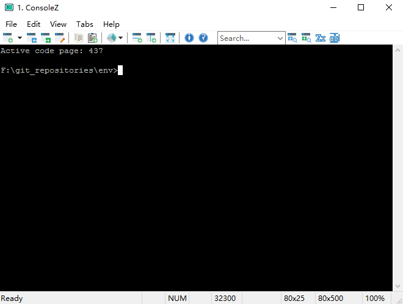
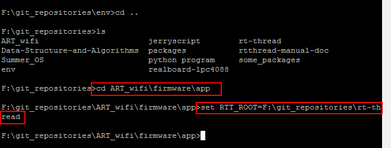
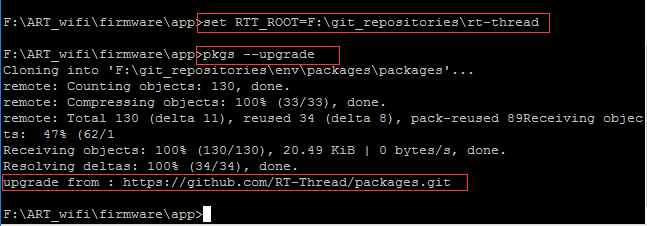
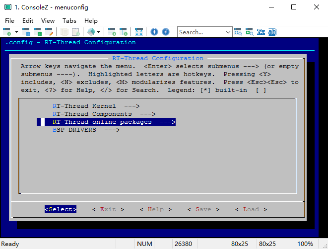

# RT-Thread 软件包环境

RT-Thread软件包环境是RT-Thread源代码的软件包开发环境，包管理系统等。提供了RT-Thread
下所需要到配置，编译等环境。

## 准备工作

* env环境编译器默认配置为GNU GCC，工具链目录指向 `env\tools\gnu_gcc`，如果未安装交叉工具链，请放置于这个目录下，如果使用其他编译方式则无需设置。
* 在电脑上装好git，因为有一些组件包是通过git来下载管理的，git的下载地址为
  `https://git-scm.com/downloads`,请根据向导正确安装git。

## 打开控制台

RT-Thread 软件包环境主要以命令行控制台为主，同时以字符型界面来进行辅助，使得尽量减少修改配置文件的方式即可搭建好RT-Thread开发环境的方式。

进入env目录，可以运行本目录下的 `console.exe` 程序，它会弹出控制台窗口，并默认配置好一些环境变量。接下来对软件包的操作都是在控制台环境下进行的，下图为控制台窗口：

## 针对BSP的配置

打开控制台后，可以在命令行模式下使用cd命令切换到对应的设备工程目录。
例如工程目录为`F:\git_repositories\ART_wifi\firmware\app`，先进入工程根目录。

如果设备工程目录中未包含RT-Thread代码，可以通过命令行：

    set RTT_ROOT=your_rtthread

的方式设置RT-Thread目录（其中your_rtthread请填写你的RT-Thread根目录位置，记住RT-Thread不要放于带空格或中文字符的目录路径下）。

在使用env的`menuconfig`命令配置功能前，如果设备工程目录(bsp)中没有相应的`KConfig`文件，可将`env`目录下的`KConfig_bsp`文件复制到bsp根目录中并改名为`KConfig`。

在bsp根目录中改名为：

在使用`menuconfig`命令之前还需要使用

    pkgs --upgrade

命令来更新我们env的组件包仓库列表

现在就可以在设备工程目录中使用`menuconfig`命令开始进行项目配置，如果没有出错接下来就可以看到`menuconfig`的界面了，如下图：

### 错误提示
如果没有使用`pkgs --upgrade`来更新列表就使用`menuconfig`命令会出现如下错误：

重新使用`pkgs --upgrade`命令即可解决这个问题。

### menuconfig的简单使用方法如下：

- 上下键：选择不同的行，移动到不同的（每一行的）选项上。

- 空格键：用于在选择该选项，取消选择该选项，之间来回切换。

  - 选择该（行所在的）选项：对应的该选项前面就变成了，中括号里面一个星号，即 **[ \* ]**，表示被选中了。
  - 如果是取消该选项，就变成了，只有一个中括号，里面是空的，即：[   ]

- 左右键：用于在Select/Exit/Help之前切换

- 回车键：左右键切换到了某个键上，此时回车键，就执行相应的动作：

  - Select：此时一般都是所在（的行的）选项，后面有三个短横线加上一个右箭头，即 —>，表示此项下面还有子选项，即进入子菜单

  - Exit：直接退出当前的配置，当你更改了一些配置，但是又没有保存，此时会询问你是否要保存当前（已修改后的最新的）配置，然后再退出。

  - Help：针对你当前所在某个（行的）选项，查看其帮助信息。如果你对某个选项的功能不是很清楚就可以查看其Help，也可以可能查到写出到配置文件中的宏。

## env 系统配置与更新

env 系统配置主要使用system命令，可以使用 system -h来获取使用帮助。

## 包管理器

### 包管理器介绍

包管理是一个软件包的平台，用户可以通过包管理器来获取，添加或者删除自己所需要的组件包。用户可以通过包管理器的wizard包制作向导功能来制作软件包并提交到rtt。目前支持的组件包格式有：.zip,.rar.gz,rar.bz2,同时支持托管在git上，并且附带有submudule的组件包。

### 包管理器命令

包管理器的操作主要使用pkgs命令，可以使用 pkgs -h来获取使用帮助。 注意：在使用menuconfig选择在线包之前，需要先使用 pkgs --upgrade 命令更新env的packages文件夹。请预先在电脑上装好git工具。

    pkgs --list            列出当前使用的组件包列表
    pkgs --update          读取目前menuconfig对项目的配置，和旧的项目配置做对比，进而更新包
    pkgs --wizard          组件包制作向导，根据提示输入来制作包向导文件夹
    pkgs --upgrade         从reposource更新env的本地packages文件夹
    example：
    使用pkgs --upgrade命令后，env环境会自动从默认git地址： https://github.com/RT-Thread/packages.git 来更新本地包。后续会支持更新源列表。

## 如何制作一个组件包

### 制作一个压缩包形式的组件包

### 制作一个git地址形式的组件包

使用menuconfig来配置项目所需要的组件包，然后通过pkgs --update命令来更新项目中的组件包。如果不想要某个组件包，可以在menuconfig的配置中去掉包选项，然后再次使用`pkgs --update`命令更新即可。

如果解压出的组件包被人为修改，那么在删除组件包的时候会提示是否要删除被修改的文件。如果选择保留文件，那么请自行保存好这些文件，避免在下次更新包时被覆盖。

支持在线下载的组件包在RT-thread online packages选项中，根据项目需要来选择所需的组件。目前可以用来测试的在线包在miscellaneous packages选项中，提供了不同类型的组件包以供测试。

## 编译RT-Thread

RT-Thread 软件包环境也携带了Python & scons环境，所以只需要在设备工程目录中运行：

    scons

就可以编译RT-Thread了。一般来说，工程所需要的环境变量都会在控制台环境中已经配置好。
