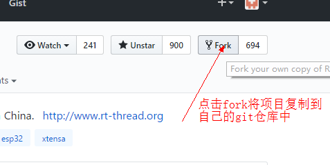
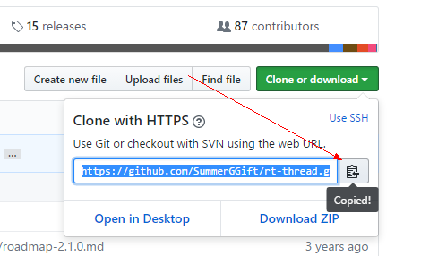
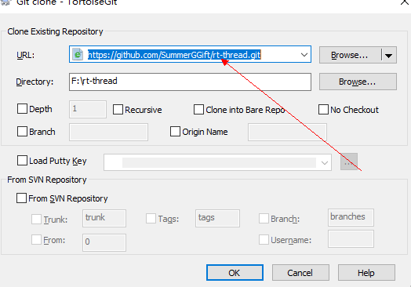
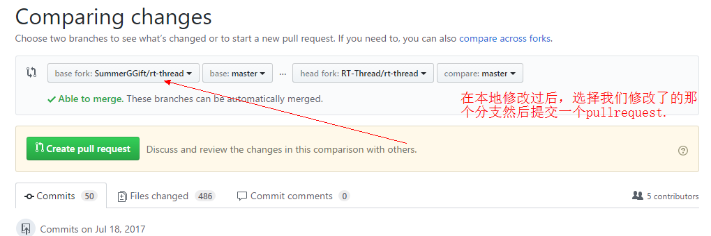

# 在github上为RT-Thread贡献代码

首先解释一下pull request这个词，pull request是一个request，它的目的是请求仓库管理人采用你提交的东西。

比如说我发现你的git仓库代码中有不完善的bugs，而我想来修改这些bugs。在把你的代码fork到我的git仓库进行修改之后，我就需要发起一个pull request来提交我的修改让你看到。如果你同意接受我的request，那么这份代码就会被merge（合并）到原来的你的git仓库中。如果不同意，这次请求就作废了。

下面是摘自[知乎](https://www.zhihu.com/question/21682976) 网友的一段解释：

    我尝试用类比的方法来解释一下pull reqeust。想想我们中学考试，老师改卷的场景吧。你做的试卷就像仓库，你的试卷肯定会有很多错误，就相当于程序里的bug。老师把你的试卷拿过来，相当于先fork。在你的卷子上做一些修改批注，相当于git commit。最后把改好的试卷给你，相当于发pull request，你拿到试卷重新改正错误，相当于merge。

    当你想更正别人仓库里的错误时，要按照下面的流程进行：

    1. 先 fork 别人的仓库，相当于拷贝一份别人的资料。因为不能保证你的修改一定是正确的，对项目有利的，所以你不能直接在别人的仓库里修改，而是要先fork到自己的git仓库中。
    2. clone到自己的本地分支，做一些bug fix，然后发起pull request给原仓库，让原仓库的管理者看到你提交的修改。 
    3. 原仓库的管理者review这个bug，如果是正确的话，就会merge到他自己的项目中。merge的意思就是合并，将你修改的这部分代码合并到原来的仓库中添加代码或者替换掉原来的代码。至此，整个 pull request 的过程就结束了，原来仓库中就有了你贡献的代码啦。

现在以rt-thread仓库为例说明贡献代码的流程：

1. 首先要将rt-thread仓库fork到自己的git仓库中。

2. 其次将rt-thread仓库clone到自己的本地PC，在本地对想要修改的内容进行修改，修改完毕后push到自己的git仓库中。

3. 在git仓库中选择自己修改了的分支，点击create pull request按钮发起pull request.

4. 发起请求成功后，RT-Thread维护人可以看到你的修改，如果同意你的代码就会被合并到仓库中，这样一次pull request就结束了。

这就是向rt-thread提交代码的方法。
